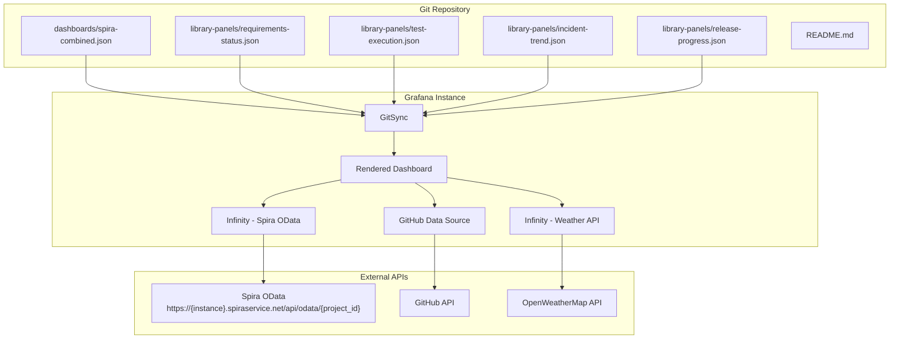

# Design Document: Spira Grafana Dashboard

## Overview

This design describes a proof-of-concept Grafana dashboard delivered as code (JSON) in a Git repository. The dashboard aggregates data from Spira's OData API, GitHub, and a supplementary source (weather or Confluence) into a single unified view of project lifecycle fitness.

The primary goal is to demonstrate that Grafana can serve as a viable alternative to PowerBI for multi-source project reporting by combining Spira project management metrics with development activity and contextual data — all importable into any Grafana instance via GitSync.

### Key Design Decisions

1. **Infinity plugin for Spira OData** — Spira does not have a native Grafana plugin. The Infinity data source plugin (`yesoreyeram-infinity-datasource`) is used as a universal REST/OData connector, supporting JSON parsing and API key authentication.
2. **GitHub data source plugin** — The official `grafana-github-datasource` plugin provides native query types for commits, pull requests, and issues.
3. **Weather via Infinity** — A public weather API (OpenWeatherMap) is queried through a second Infinity instance, demonstrating that the same plugin type can be reused with different configurations.
4. **Data source references by name** — All panel JSON references data sources by their `name` field (not UID), making the dashboard portable across Grafana instances.
5. **Library panels for reusability** — Common panel definitions are extracted into `library-panels/` so they can be shared across dashboards and versioned independently.
6. **No infrastructure code** — The repository contains only dashboard JSON, library panel JSON, and documentation. No Docker, Terraform, or server configuration.

## Architecture



### Data Flow

1. A Grafana administrator configures GitSync to point at this repository.
2. Grafana discovers the dashboard JSON and library panel files.
3. When the dashboard loads, each panel executes its query against the configured data source.
4. The Infinity plugin sends HTTP GET requests to Spira's OData endpoint and the weather API; the GitHub plugin queries GitHub's GraphQL API.
5. Responses are parsed, transformed (where needed via JSONPath/UQL), and rendered as panels.

## Components and Interfaces

### Repository File Structure

```
/
├── dashboards/
│   └── spira-combined.json          # Main dashboard definition
├── library-panels/
│   ├── requirements-status.json     # Pie/bar chart: requirement status breakdown
│   ├── test-execution.json          # Pie/bar chart: test run results
│   ├── incident-trend.json          # Time-series: open vs closed incidents (90 days)
│   └── release-progress.json        # Gauge/bar: % complete per active release
├── README.md                        # Setup documentation
└── .kiro/                           # Spec files (not imported by Grafana)
```

### Data Source Configurations (Required in Target Grafana)

| Data Source Name | Plugin Type | Purpose |
|---|---|---|
| `Spira-OData` | `yesoreyeram-infinity-datasource` | Queries Spira OData entity sets |
| `GitHub` | `grafana-github-datasource` | Queries GitHub repository activity |
| `Weather-API` | `yesoreyeram-infinity-datasource` | Queries OpenWeatherMap current weather |

### Dashboard Sections (Top-to-Bottom Layout)

| Section | Source | Panels |
|---|---|---|
| **Project Health (Spira)** | `Spira-OData` | Requirements Status, Test Execution Results, Incident Trend, Release Progress |
| **Development Activity (GitHub)** | `GitHub` | Commit Activity (30 days), Pull Requests (open/merged), Open Issues |
| **Supplementary Context** | `Weather-API` | Current Weather (temperature, condition, humidity) |

### Panel Interfaces

Each panel in the dashboard JSON follows Grafana's standard panel model:

```json
{
  "type": "<visualization-type>",
  "title": "<panel-title>",
  "datasource": {
    "type": "<plugin-id>",
    "uid": "${DS_NAME}"
  },
  "targets": [ /* query definitions */ ],
  "fieldConfig": { /* thresholds, units, overrides */ },
  "gridPos": { "h": <height>, "w": <width>, "x": <col>, "y": <row> }
}
```

For portability, the `datasource.uid` uses a Grafana variable syntax (`${DS_NAME}`) or the data source is referenced by name string (e.g., `"datasource": "Spira-OData"`).

### Spira OData Query Interface

Queries to Spira use the Infinity plugin configured with:
- **Type**: JSON
- **Parser**: Backend
- **URL pattern**: `Requirements`, `Incidents`, `TestRuns`, `Releases` (appended to the base URL)
- **Authentication**: API key passed as query parameter (`?username={user}&api-key={key}`)

Example OData query for requirements:
```
GET /api/odata/{project_id}/Requirements?$select=RequirementId,Name,RequirementStatusId&$filter=IsDeleted eq false
```

### GitHub Query Interface

The GitHub data source plugin exposes native query types:
- **Commits**: Repository, time range (last 30 days)
- **Pull Requests**: State filter (open, merged), time range
- **Issues**: State filter (open), labels

### Weather Query Interface

A second Infinity instance configured with:
- **Base URL**: `https://api.openweathermap.org/data/2.5`
- **Authentication**: API key as query parameter (`?appid={key}`)
- **Query path**: `/weather?q={city}&units=metric`

## Data Models

### Spira OData Entities

**Requirements Entity**
| Field | Type | Description |
|---|---|---|
| RequirementId | integer | Unique identifier |
| Name | string | Requirement name |
| RequirementStatusId | integer | Status enum (1=Requested, 2=In Progress, 5=Developed, 7=Tested) |
| ReleaseId | integer | Assigned release |
| IsDeleted | boolean | Soft-delete flag |

**Incidents Entity**
| Field | Type | Description |
|---|---|---|
| IncidentId | integer | Unique identifier |
| Name | string | Incident name |
| IncidentStatusId | integer | Status (1=New/Open, 2=Assigned, 5=Closed, 6=Resolved) |
| CreationDate | datetime | When incident was created |
| ClosedDate | datetime | When incident was closed |

**TestRuns Entity**
| Field | Type | Description |
|---|---|---|
| TestRunId | integer | Unique identifier |
| ExecutionStatusId | integer | Result (1=Failed, 2=Passed, 3=Not Run, 5=Blocked) |
| EndDate | datetime | Execution completion time |

**Releases Entity**
| Field | Type | Description |
|---|---|---|
| ReleaseId | integer | Unique identifier |
| Name | string | Release name |
| ReleaseStatusId | integer | Status (1=Planned, 2=Active, 3=Closed) |

### GitHub Data Model (from plugin)

| Query Type | Key Fields |
|---|---|
| Commits | `author`, `date`, `message`, `sha` |
| Pull Requests | `title`, `state`, `created_at`, `merged_at` |
| Issues | `title`, `state`, `created_at`, `labels` |

### Weather Data Model

| Field | Type | Description |
|---|---|---|
| temp | number | Current temperature (°C) |
| description | string | Weather condition text |
| humidity | number | Humidity percentage |
| city | string | Location name |

### Dashboard JSON Model (Grafana Standard)

```json
{
  "id": null,
  "uid": null,
  "title": "Spira Combined Lifecycle Dashboard",
  "tags": ["spira", "lifecycle", "poc"],
  "timezone": "browser",
  "schemaVersion": 39,
  "version": 0,
  "panels": [],
  "templating": { "list": [] },
  "time": { "from": "now-90d", "to": "now" },
  "refresh": "5m"
}
```

## Error Handling

Since this is a dashboard-as-code project (static JSON artifacts consumed by Grafana), error handling is primarily delegated to Grafana's native mechanisms:

| Scenario | Handling Strategy |
|---|---|
| Data source connection failure | Grafana displays its default "No data" or error state on affected panels. Other panels remain functional due to Grafana's per-panel error isolation. |
| OData entity returns zero records | Panels configured with `noDataMessage` display "No data" rather than rendering empty charts. |
| Authentication failure (expired API key) | Grafana shows an authentication error on the panel. Dashboard structure remains intact. |
| Invalid JSON in dashboard file | Grafana GitSync rejects the file during import and logs an error. Previous valid state is retained. |
| Missing data source in target instance | Panels referencing the missing source show "Datasource not found" error. Other panels work normally. |
| Network timeout to external API | Infinity plugin respects its configured timeout (default 60s) and returns an error state to the panel. |

### Design Principle: Graceful Degradation

The dashboard is designed so that each section is independent. A failure in one data source does not cascade to other sections. This is achieved through:

1. **Separate data source references per panel** — No panel queries multiple data sources.
2. **No cross-panel dependencies** — No panel transformations depend on results from another panel.
3. **Section heading rows** — Visual separation means users can identify which section is affected.

## Testing Strategy

### Why Property-Based Testing Does Not Apply

This feature produces static JSON configuration files (Grafana dashboard and library panel definitions). There are no pure functions with meaningful input variation:

- The dashboard JSON is a fixed artifact, not a function that produces different outputs for different inputs.
- The "logic" lives in Grafana's rendering engine, not in our code.
- Validation of JSON structure is best served by schema validation and structural assertion tests.
- Integration behavior (data source connectivity, rendering) requires a running Grafana instance.

PBT is NOT appropriate for this feature. The testing strategy uses structural validation, schema checks, and manual integration verification instead.

### Testing Approach

#### 1. Structural Validation Tests (Automated)

These are assertion-based tests that validate the JSON files conform to required rules:

| Test | What It Validates | Requirement |
|---|---|---|
| Data source references use names not UIDs | All `datasource` fields use name strings, no hardcoded UIDs | 5.4 |
| Section ordering is correct | Spira panels have lower `gridPos.y` than GitHub panels, which are lower than Supplementary panels | 4.2 |
| No individual theme overrides | No panel contains per-panel color scheme overrides | 4.4 |
| Single-page layout | No tab or nested folder structures in the panels array | 4.1 |
| Required Spira panels exist | Panels for Requirements Status, Test Execution, Incident Trend, Release Progress are present | 6.1–6.4 |
| Required GitHub panels exist | Panels for commits, PRs, issues are present | 2.2 |
| Supplementary panel exists | At least one weather/Confluence panel is present | 3.1 |
| Library panels directory exists | `library-panels/` contains valid JSON files | 5.2 |
| No infrastructure files | Repository does not contain Dockerfile, docker-compose, terraform files | 5.6 |
| README documents data sources | README lists each data source name, plugin type, and config prerequisites | 5.5 |

#### 2. JSON Schema Validation (Automated)

Validate dashboard and library panel JSON files against Grafana's dashboard schema to catch structural errors before import.

#### 3. Manual Integration Tests

| Test | What It Validates | Requirement |
|---|---|---|
| GitSync import | Dashboard loads without errors via GitSync | 5.3 |
| Spira OData connectivity | Panels render Spira data correctly | 1.1–1.3 |
| GitHub connectivity | Panels render GitHub data correctly | 2.1–2.2 |
| Weather connectivity | Weather panel shows temp/condition/humidity | 3.3 |
| Error isolation | Disconnecting one source doesn't break others | 1.4, 2.4, 3.5, 4.5 |
| Load time | Dashboard renders within 10 seconds | 4.3 |
| Empty data handling | Panels show "No data" for zero-record entities | 6.5 |

#### 4. Test Tooling

- **Node.js / Jest** for structural validation tests (JSON parsing and assertion)
- **ajv** or similar JSON Schema validator for schema checks
- **Manual testing** in a Grafana Cloud or self-hosted instance for integration verification

### Test Execution

```bash
# Run structural validation tests
npm test

# Validate JSON schema (if implemented)
npm run validate
```

